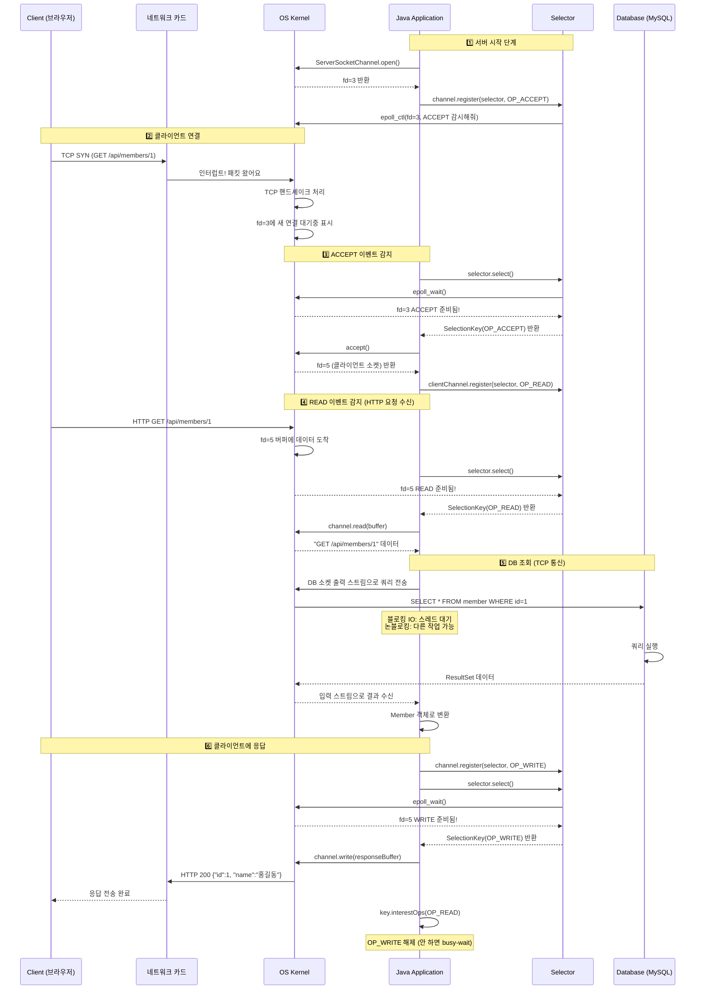

# 7장 Io병목 해결
## 네트워크 io와 자원효율
서버 프로그램은 기본적으로 네트워크 프로그램이다. 다양한 구성요소와 네트워크로 데이터를 주고받는다.
클라이언트와는 HTTP통신을 한다.
DB는 TCP 기반으로 통신한다.
k8s ClusterIP 서비스는 L4 레벨에서 동작해서 HTTP 같은 L7 프로토콜을 직접 다루지 않고, TCP 연결만 대상으로 트래픽을 전달한다.

네트워크 통신은 2가지로 된다.
출력 스트림으로 데이터 내보내기
입력 스트림으로 데이터 받기
예시) 서버가 db에 출력 스트림으로 쿼리를 보냄
-> db에서 온 데이터를 입력 스트림으로 받음. 

일반적으로 입출력이 되는 동안 해당 스레드는 블로킹 상태로 대기한다. 
그래서 cpu사용률을 높이기 위해서 스레드를 많이 만들면 되는데 이것도 스레드가 메모리를 잡아먹기 때문에 무한정 많이 만들 수 없다. 

만약 스레드를 많이 만든다고 해도, 하나의 cpu가 컨텍스트 스위칭을 하면서 수많은 스레드의 작업을 처리하면 컨텍스트 스위칭 비용이 많이 든다. 

톰캣은 요청마다 스레드를 할당하는데, 이렇게 하면 스레드가 많아져서 메모리를 많이 잡아먹고 컨텍스트 스위칭으로 cpu 자원도 낭비된다.
그럼에도 불구하고 대다수의 서비스는 사용자가 많지 않기 때문에 괜찮다. 

하지만 이제 점점 서비스가 성장하면 메모리, cpu자원을 절감하기 위해서 2가지 방법이 있다
- 가상스레드, 고 루틴, 코루틴과 같은 경량 스레드 사용
- 논블로킹 또는 비동기 io 사용

실제로 성능 문제가 생길 때 도입을 고려해보는 것이 좋다. 

## 가상 스레드로 자원 효율 높이기
경량 스레드는 os가 관리하는 스레드가 아니라 jvm같은 같은 언어의 런타임이 관리하는 스레드이다. 
언어 런타임이 os스레드로 실행할 경량 스레드를 스캐줄링 한다. 
스케줄러 풀에는 os 스레드와 같은 수의 1:1로 매핑된(마운트된) 플랫폼 스레드(캐리어 스레드라고도 한다)가 있다. 

기본 스레드 크기가 1mb인데, 가상스레드는 2kb수준이다. 

1만개의 가상스레드 + 8개의 플랫폼 스래드 = 28mb정도만 사용한다. (물론 호출 스택의 깊이에 따라서 스래드 크기를 늘렸다가 줄인다)

### 네트워크 io와 가상 스레드
synchronized일 경우 플랫폼 스레드에 블라킹이 걸린다

### 가상스레드와 성능
io작업일 때 효과가 좋음. cpu작업에서는 효과 없음
가상스레드가 플랫폼 스레드보다 적으면 이점을 못얻는다. 

원래는 스래드풀을 만들어서 사용하는데, 가상스레드는 생성비용이 워낙 작아서 미리 스레드풀을 만들어두지는 않고, 그냥 생성해서 사용하고 다 쓰면 소멸시킨다. 

### 가상스레드의 장점
기존 코드를 크게 바꿀 필요가 없다는 것임. 

## 논 블로킹 IO로 성능 높이기
사용자가 폭발적으로 증가하면 언젠가는 가상스레드도 한계가 오긴 한다. 메모리를 잡아먹고 스케줄링에 시간을 쓰기 때문.

### 논블로킹 io 동작 개요
스래드가 입출력 끝날때까지 대기하지 않는다

1️⃣ Channel을 논블로킹 모드로 설정
```
SocketChannel channel = SocketChannel.open();
channel.configureBlocking(false);
```
- Selector는 논블로킹 채널만 등록 가능

2️⃣ Selector 생성
```java
Selector selector = Selector.open();
```
- 내부적으로 OS의 이벤트 감시 객체(epoll fd 등) 생성 
- Java는 OS마다 다른 구현을 SelectorProvider로 추상화

3️⃣ Channel을 Selector에 등록 (register)
```java
channel.register(selector, SelectionKey.OP_READ);
```
이 시점에 일어나는 일:

- Selector가 **“이 채널에서 READ 이벤트를 감시해라”**라고 OS에 등록
- 반환되는 SelectionKey는
👉 채널 ↔ selector ↔ 관심 이벤트를 잇는 연결 고리

4️⃣ select() 호출 → 이벤트 대기
```java
int readyCount = selector.select();
```

5️⃣ 준비된 채널 목록 획득
```java
Set<SelectionKey> keys = selector.selectedKeys();
```
- 이 Set에는 지금 당장 처리 가능한 채널들만 들어 있음 
- 전체 채널 ❌ / 준비된 채널 ⭕


새 다이어그램은 6단계로 구성됩니다:
1. 서버 시작 - Selector에 채널 등록
2. 클라이언트 연결 - TCP 핸드셰이크
3. ACCEPT 이벤트 - 클라이언트 소켓 생성 및 READ 등록
4. READ 이벤트 - HTTP 요청 수신
5. DB 조회 - 출력/입력 스트림으로 쿼리 송수신
6. 응답 - 클라이언트에 JSON 반환

### 논블로킹 I/O 핵심 정리
**핵심 아이디어: READ/WRITE 단계 분리 + Selector 위임**
```
블로킹:   요청 → [처리...대기...대기...] → 응답  (스레드 묶임)

논블로킹: 요청(READ) ──────────────────→ 응답(WRITE)
              ↓                              ↑
           분리!           Selector가 "응답 생성 가능해!"라고 알려줌
```

**Selector의 역할: io 반환값이 준비된 것만 알려주기**
- 스레드가 "기다리는" 대신, Selector가 "준비된 채널만" 통보
- 스레드는 실제로 할 일이 있을 때만 작동 → 효율 극대화

**주의: DB도 논블로킹이어야 완전한 효과**
- 전통적인 JDBC는 블로킹 → DB 호출 시 스레드 블록됨
- R2DBC 같은 리액티브 드라이버 사용 시 진정한 논블로킹 가능 ??

# Member 조회 요청 전체 흐름 (DB 포함)


## SelectionKey 이벤트 종류
Selector에 채널을 등록할 때 감시할 이벤트 타입을 지정한다.

| 상수 | 값 | 의미 | 사용 채널 |
|------|-----|------|-----------|
| `OP_ACCEPT` | 16 | 새 클라이언트 연결 수락 준비됨 | ServerSocketChannel |
| `OP_CONNECT` | 8 | 서버에 연결 완료됨 | SocketChannel (클라이언트) |
| `OP_READ` | 1 | 데이터 읽기 준비됨 (버퍼에 데이터 도착) | SocketChannel |
| `OP_WRITE` | 4 | 데이터 쓰기 준비됨 (버퍼에 공간 있음) | SocketChannel |

### 이벤트 흐름 요약
1. **OP_ACCEPT**: 서버가 클라이언트의 연결 요청을 받아들일 준비가 됨
2. **OP_READ**: 클라이언트가 보낸 데이터가 커널 버퍼에 도착함
3. **OP_WRITE**: 클라이언트에게 응답을 보낼 준비가 됨

### OP_READ vs OP_WRITE 등록 시점
**왜 OP_WRITE는 처음부터 등록하지 않는가?**

OP_WRITE는 소켓 버퍼에 공간만 있으면 "준비됨" 상태가 된다.
→ 보낼 데이터가 없는데도 select()가 계속 "WRITE 가능!" 반환
→ CPU 낭비 (busy-wait)

| 이벤트 | 등록 시점 | 이유 |
|--------|-----------|------|
| OP_READ | 연결 직후 바로 등록 | 언제 데이터 올지 모름 |
| OP_WRITE | 보낼 데이터 있을 때만 등록 | 평소엔 항상 준비 상태라 의미 없음 |

**OP_WRITE 해제 패턴 (실제 코드)**
```java
// WRITE 이벤트 처리
if (key.isWritable()) {
    int written = channel.write(buffer);

    if (!buffer.hasRemaining()) {  // 다 보냄
        key.interestOps(OP_READ);  // WRITE 해제!
    }
}
```
→ 해제 안 하면 select()가 계속 "WRITE 가능!" 반환 → CPU 낭비 (busy-wait)

## 리액터 패턴
동시에 들어오는 여러 이벤트를 처리하기 위한 패턴
리액터와 핸들러로 구성됨. 리액터가 이벤트 발생시까지 대기하다가 알맞는 헨들러에 이벤트 전달함.

## 프레임워크 사용하기
논블로킹 I/O를 직접 구현하면 복잡한 문제들이 생긴다:
- 클라이언트별 버퍼 관리
- 불완전한 메시지 조립 (한 요청이 여러 read()에 나눠서 도착)
- Selector 이벤트 루프 관리
- 프로토콜 파싱

**Netty 같은 프레임워크가 이를 모두 추상화해준다.**

| 프레임워크 | 특징 |
|------------|------|
| **Netty** | 가장 널리 쓰임, 고성능 |
| **Spring WebFlux** | Netty 기반 + 리액티브 스트림 |
| **Vert.x** | 폴리글랏, 이벤트 기반 |

```
직접 NIO 구현 → 학습용 / 특수한 경우
실무           → Netty, WebFlux 등 프레임워크 사용
```
