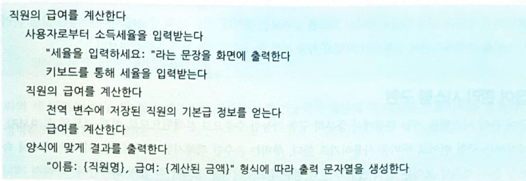

# 객체분해
사람 인지 과부하를 줄이는 방법 = 추상화

## 프로시저 추상화와 데이터 추상화
프로시저 추상화: 기능분해

데이터 중심 추상화: 타입 추상화(추상데이터 타입), 프로시저 추상화(객체지향)

## 프로시저 추상화와 기능분해
알고리즘 분해, 기능 분해

거의 유사하게 동작하는 함수들을 한 곳에 모아둠. 

시스템은 하나의 큰 메인함수가 된다.

하향식 접근법을 따른다. 

기능을 중심으로 해서 로직을 짜고, 데이터는 기능을 뒤따를 뿐이다. 

-> 하향식 설계가 가지는 문제점은?

비즈니스 로직과 인터페이스 로직이 강결합된다.
main함수에 새로운 인터페이스 추가하는게 여간 어려운 일이 아니다.

결국 인터페이스 하나 추가하는데 내부 구현을 자꾸 바꿔야하는게 마음에 안든다?
동작하는 방식이 하나씩 더 추가될 수 있는데, 객체지향적으로 해놓으면 내부 구현 변경 없이 그냥 수정 가능하다.
반면에 하향식 접근법에서는 구현을 계속 수정하면서 가야한다. 

알고리즘 분해로만 해놓으면 계속 변경마다 수정해야한다. 

변경이 미치는 영향도 파악하는게 쉽지 않다.

---
객체지향을 해야지 데이터와 관련된 로직이 한데 다 묶여 있어서 수정시 변경을 파악하기 쉽다. 

데이터와 함께 변경되는 부분과 그렇지 않은 부분을 명확하게 분리해야한다. 

---
## 3 정보 은닉과 모듈
모듈은 복잡한 것과 변경 가능한 것들을 내부에 숨겨야한다.
다만 모듈은 인스턴스 개념을 제공하지 않는다. 

---
## 4. 데이터 추상화와 추상 데이터 타입
추상 데이터 타입은 데이터를 객체로 표현은 하지만 기능 자체는 외부에 정의함. 
이거를 객체라고 하는 것 같다. 

추상 데이터 타입은 오퍼레인션 별로 객체를 묶어서 if 로 표현함
객체지향은 객체별로 오퍼레이션을 묶음. -> 타입별로 객체 생성

객체지향에서는 타입 변수를 이용한 조건문을 다형성으로 대체한다.

이를 통해서 계방 폐쇄 원칙을 찾을 수 있다. 

---
오퍼레이션 추가가 주된 변경이라면 추상 데이터 타입을

새로운 타입 추가가 주된 변경이라면 객체지향을 선택해보자!

