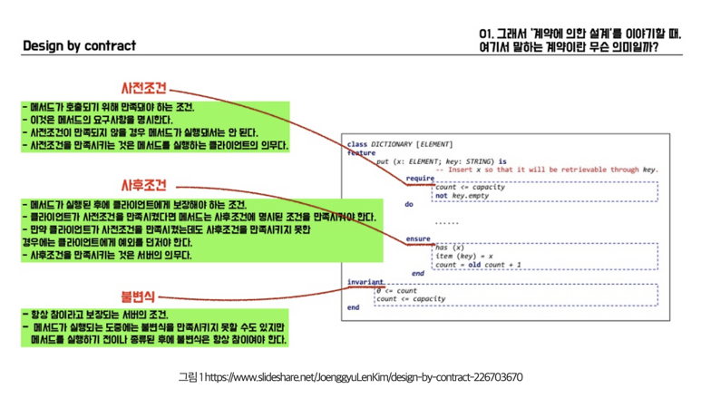

# 계약에 의한 설계(design by contract, dbc)
명령으로 인한 부수효과를 어떻게 효과적으로 다룰 수 있을까?

계약을 위한 설계 라이브러리가 있나?

## 01 협력과 계약
### 부수효과를 명시적으로 
인터페이스 사용: 객체가 수신할 수 있는 메세지는 정의가능
하지만 객체 사이의 의사소통 방식은 명확하게 정의 불가능

약속과 제약은 인터페이스로 설계 불가능

계약서 = 이익 + 의무로 구성된다.
대신 하기로 한 것만 지킨다면 구체적인 구현은 상관없음.

## 02 계약에 의한 설계
사전조건
사후조건
불변식


자바에서는 assert를 사용해서 사후조건 명시 가능.
표준 함수(require, check, assert)와 실험적 “contracts” DSL로 일부를 보완한다
```kotlin
fun transfer(from: Account, to: Account, amount: Int) {
    require(from != to) { "same account" }         // 입력 검증
    require(amount > 0)   { "amount > 0" }         // 사전조건
    check(from.balance >= amount) { "insufficient" } // 상태 확인(비즈 규칙)
    // ...
}
```

## 03 계약에 의한 설계와 서브타이핑
서브타입이 리스코프치환원칙을 준수하기 위해서 수퍼타입의 계약을 만족해야한다

즉 기대되는건, 계약규칙 과 가변성 규칙 준수이다.

서브타입에서 사전조건이 더 강화되어서는 안된다.
클라이언트는 수퍼타입만 알고 있기 때문에 수퍼타입의 입장에서 넣었는데 서브타입에서 사전조건이 강화되면 문제가 된다.

사후조건은 더 완화하면 안되고, 대신 더 강화할 수는 있다. 왜냐하면 클라이언트 입장에서는 수퍼클래스가 이건 무조건 보장한다는게 사후조건인데, 완화하면 그걸 보장해주지 않기 때문이다.

불변식의 경우에는 수퍼클래스에서 정의하고는 수정안되도록 private으로 아예 막는게 필요하다. 

### 가변성 규칙
?? 서브타입은 슈퍼타입이 발생시키는 예외와 다른 타입의 예외를 발생시켜서는 안된다?

한번에 예외를 두개 다 잡지 못하기 때문에 서브타입이 못된다.

---

공변성 : 서브타입 관계가 정상적으로 이뤄짐
반공변성: 서브타입 관계가 반대로 이뤄짐
무공변성: 서브타입 관계가 없음


